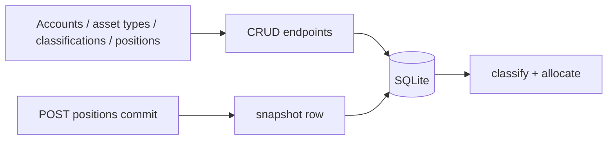

# OpenPortfolio v0.1.5 Execution Plan

**Status:** draft · 2026-04-19  
**Authoritative product spec:** [../openportfolio-roadmap.md](../openportfolio-roadmap.md)  
**Authoritative technical spec:** [../architecture.md](../architecture.md)  
**Sequencing:** entity management before v0.2 PDF import — users must be able to review and edit proposed accounts, asset types, and positions.

---

## Guardrails (from [CLAUDE.md](../../CLAUDE.md))

- Math in Python, never in the LLM.
- Every LLM extraction ships with schema + confidence + source span + deterministic validation + mandatory review UI (unchanged from v0.1).
- Every user-visible number shows provenance on hover.
- One feature per branch. If a task touches >5 files, split it.
- Tests land with every extraction fixture and allocation calc.

## Current state

- v0.1 Foundation is **shipped** per [v0.1 execution plan](../v0.1/execution_plan.md) checklist (M0–M5 code complete; M5 maintainer acceptance may still be pending).
- Structural gaps: account `type` is a hardcoded dropdown in `frontend/app/accounts/page.tsx`. Manual asset kinds are a hardcoded TS union + Python `_SYNTHETIC_PREFIXES` in `backend/app/classifications.py`. `Classification` DB table supports user overrides but has no UI. Accounts have create + list only (no edit/delete).

## Flow being built

## Milestones

### M1 — Asset types as data

- New `asset_types` table. Seed from current `_SYNTHETIC_PREFIXES` in `backend/app/classifications.py`.
- Backend CRUD for asset types.
- `/asset-types` page: list, create, edit, delete. Delete blocked if any position ticker uses that prefix.
- `/manual` dropdown loads kinds from API. Remove hardcoded `AssetKind` union once API is source of truth.
- `classify()` resolves synthetic prefixes from DB instead of the in-code dict.

### M2 — Account CRUD completeness

- `PATCH /api/accounts/{id}` and `DELETE /api/accounts/{id}` (delete with cascade confirmation; schema already cascades positions).
- `/accounts` page: edit label and type, delete account.
- Replace hardcoded `TYPE_OPTIONS` with free-form type string + autocomplete from existing account types in DB.

### M3 — Classification override UI

- `/classifications` page: tickers from YAML baseline, DB user rows, and tickers seen in committed positions.
- `GET /api/classifications`, `PATCH /api/classifications/{ticker}` writing `Classification` with `source="user"`.
- Show when user value differs from YAML (no silent drift).

### M4 — Positions review polish

- Extend `/positions`: filter by account, source, date; batch delete where safe.
- Match existing inline styles (no design-system work — that is v0.3).

### M5 — Snapshot-on-commit

- After successful `POST /api/positions/commit`, insert one `snapshots` row (`net_worth_usd`, `payload_json` with allocation summary or positions snapshot — pick minimal deterministic shape).
- No UI. Enables v0.6 historical view to have real data.

### M6 — Docs + acceptance

- Update [README.md](../../README.md) for new routes and flows.
- **Acceptance:** Create custom asset type `WINE`, add a position, override a listed ETF classification, edit an account, delete a bad position — all in UI, zero code edits. Confirm snapshot rows exist for commits during the test.

## Explicitly NOT in v0.1.5

- Visual design tokens / shared component library (v0.3).
- Mobile layout beyond what exists (v0.3).
- Timeline UI (v0.6).
- PDF import (v0.2).
- Magic-link auth (v0.5).
- LLM or extraction pipeline changes beyond wiring new entities.

## Scope discipline

If broker APIs, PDF, OCR, tax, or targets creep in, stop and split.

---

**Prior:** [v0.1 execution plan](../v0.1/execution_plan.md)
