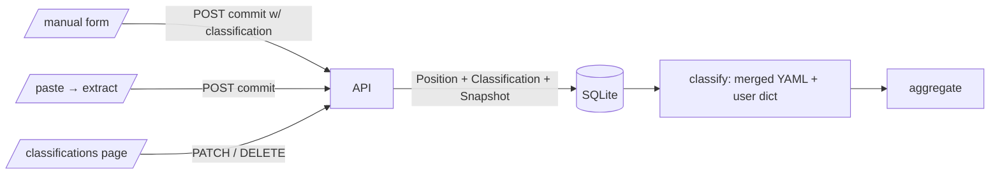

# OpenPortfolio v0.1.5 Execution Plan

**Status:** shipped · 2026-04-19
**Authoritative product spec:** [../openportfolio-roadmap.md](../openportfolio-roadmap.md)
**Authoritative technical spec:** [../architecture.md](../architecture.md)

---

## User stories

End-user point of view for the phase. Every milestone maps back to one of these; acceptance (M7) walks them in order.

1. **As a portfolio owner**, I can add a non-brokerage asset (wine, real estate, a new crypto) from the UI by choosing its asset class and entering a value, so it appears in my sunburst immediately — no code edits, no YAML file.
2. **As a portfolio owner**, I can override how any ticker is classified (e.g., reclassify VTIP from short-treasury to TIPS), and the sunburst + hover provenance reflect my override.
3. **As a portfolio owner**, I can edit and delete accounts — not just create — so I can rename "Fidelity" to "Fidelity Taxable", change types, or clean up mistakes without touching SQL.
4. **As a portfolio owner**, I can review and clean up my positions (filter by account, source, date; batch-delete stale rows) so the review loop after each paste stays fast.
5. **As a portfolio owner**, every position commit silently captures a point-in-time snapshot, so when timeline views ship later (v0.6) they have real history to plot.
6. **As a portfolio owner**, the system prevents me from silently orphaning data — deleting a classification that positions still reference is blocked with a clear message.

---

## Guardrails (from [CLAUDE.md](../../CLAUDE.md))

- Math in Python, never in the LLM.
- Every LLM extraction ships with schema + confidence + source span + deterministic validation + mandatory review UI (unchanged from v0.1).
- Every user-visible number shows provenance on hover.
- One feature per branch. Touches >5 files → stop, split.
- Tests land with every extraction fixture and allocation calc.

## Key design decision

Drop the synthetic prefix system (`REALESTATE:*`, `GOLD:*`, etc.). Every asset — brokerage or non-brokerage — has its own `Classification` row. `/manual` writes the classification directly when a position is committed, and `classify()` is a pure dict lookup over the merged YAML + user DB rows. No "asset type" table, no `:`-split fallback.

Existing v0.1 synthetic-ticker positions are migrated at startup into per-ticker Classification rows (`source='user'`) so their classification survives the upgrade.

## Data flow

## Milestones (shipped)

### M1 — Classification merge + Provenance extension

- `backend/app/models.py`: `Provenance.entity_key: str | None` added (SQLite startup migration wires it into existing DBs).
- `backend/app/classifications.py`: `load_user_classifications(db)` pulls DB rows into a `ClassificationEntry` dict. `source` attribute added to `ClassificationEntry`.
- `backend/app/main.py` `get_allocation`: merges `{**yaml, **user}` before aggregating.
- `backend/app/allocation.py`: tracks per-ticker `classification_sources` in `AllocationResult`; a user override suppresses lookthrough decomposition for that ticker (intent: "classify this my way").

### M2 — Account CRUD completeness

- `PATCH /api/accounts/{id}` and `DELETE /api/accounts/{id}` (cascades positions).
- `frontend/app/accounts/page.tsx`: inline edit label + type, delete with confirmation. Hardcoded type dropdown replaced with free-form input + datalist of types already in DB.

### M3 — `/classifications` page + API

- `GET /api/classifications` — merged YAML baseline + user rows, tagged `source` and `overrides_yaml`.
- `GET /api/classifications/taxonomy` — the asset-class enum with friendly labels ("Fixed Income") for the dropdown.
- `PATCH /api/classifications/{ticker}` — upsert user row, write Provenance per field.
- `DELETE /api/classifications/{ticker}` — revert to YAML. Returns **409** with a clear message when the ticker has no YAML fallback and positions still reference it (user story 6).
- New page `frontend/app/classifications/page.tsx`: flat table, search by ticker, filter by source, inline edit, revert/delete per row, empty-state banner on first load.
- Hero sunburst drill panel ([frontend/app/page.tsx](../../frontend/app/page.tsx)) now shows a "your override" badge next to tickers whose classification source is `user`.

### M4 — `/manual` rewrite, delete prefix logic, migrate synthetic positions

- `frontend/app/manual/page.tsx` rewritten: user picks asset class (friendly-labeled dropdown) + sub_class/sector/region; ticker = slug of label. No more `AssetKind` union.
- `POST /api/positions/commit`: accepts optional `classification` payload per row → writes a user `Classification` row in the same transaction and auto-suffixes ticker on collision (`gold-bar`, `gold-bar-2`, …). Response includes final `tickers` array for UI feedback.
- `_SYNTHETIC_PREFIXES` renamed to `_LEGACY_SYNTHETIC_PREFIXES` and used only by `migrate_synthetic_positions` (startup one-shot, idempotent) that converts existing `PREFIX:suffix` positions into per-ticker user Classification rows.
- `classify()` simplified to a pure dict lookup — no `:`-split branch.

### M5 — Positions review polish

- `frontend/app/positions/page.tsx`: filters (account, source-contains, as-of date range), batch checkbox selection, "Delete N selected" action. Filter state is client-side; position volume is small enough that server-side filtering is overkill for v0.1.5.

### M6 — Snapshot-on-commit

- `commit_positions` writes a `Snapshot` row on every successful commit. Payload: `{total_usd, by_asset_class, summary, unclassified_count}`. Deterministic shape (sorted keys) so v0.6's timeline can diff snapshots reliably.

### M7 — Docs + acceptance

- User-stories section added at top of this file (new convention — see roadmap §4.2).
- [README.md](../../README.md) updated for `/classifications` route and rewritten `/manual` flow.

## Acceptance walkthrough (UI only, zero code edits)

1. **Non-brokerage add** (story 1): `/manual` → pick asset class = Commodity, sub-class "wine", label "Wine bottle 2019", value 1200 → save. Home page sunburst shows Commodity → wine bucket grew by $1200.
2. **Ticker auto-suffix**: `/manual` → same label, same values → save. Status message shows `wine-bottle-2019-2`.
3. **Classification override** (story 2): `/classifications` → edit BND → sub-class `us_treasury` → save. Home page: BND's $ now in US → us_treasury wedge. Drill into that wedge → BND listed with "your override" badge.
4. **Orphan-delete block** (story 6): `/classifications` → delete the `wine-bottle-2019` row → 409 error banner: "2 positions reference 'wine-bottle-2019'; delete or reclassify them first."
5. Delete both wine positions on `/positions` → retry classification delete → succeeds.
6. **Account edit** (story 3): `/accounts` → edit an account's label, save.
7. **Positions filter + batch** (story 4): `/positions` → filter source contains "paste", select a few, "Delete N selected" → confirm → rows removed.
8. **Snapshots exist** (story 5): `GET /api/export` returns `snapshots[]` with one row per commit made during the test.

## Explicitly NOT in v0.1.5

Design tokens / shared component library (v0.3). Mobile layout (v0.3). Timeline UI (v0.6). PDF import (v0.2). Magic-link auth (v0.5). LLM pipeline changes beyond classification wiring.

## Scope discipline

If broker APIs, PDF, OCR, tax, or targets creep in, stop and split.

---

**Prior:** [v0.1 execution plan](../v0.1/execution_plan.md)
