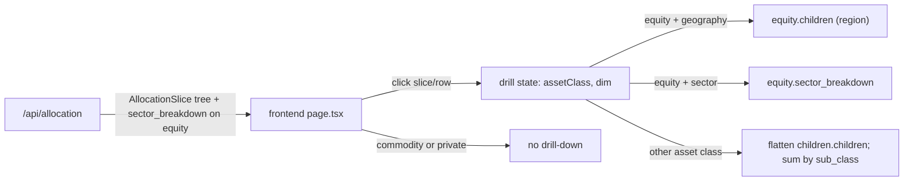

# OpenPortfolio v0.1.6 Execution Plan

**Status:** draft · 2026-04-20
**Authoritative product spec:** [../openportfolio-roadmap.md](../openportfolio-roadmap.md)
**Authoritative technical spec:** [../architecture.md](../architecture.md)

---

## User stories

End-user point of view for the phase. Every milestone maps back to one of these; acceptance walks them in order.

1. **As a portfolio owner**, I can see my asset allocation at a glance on a single clean donut — net worth in the center, one slice per asset class — without hunting through three concentric rings.
2. **As a portfolio owner**, I can click any slice (or its row in the side table) to drill into that asset class's natural sub-breakdown, and a breadcrumb gets me back to the root. One level only — no lost context.
3. **As a portfolio owner**, when I drill into equity I can toggle the view between **Geography** and **Sector**, because those are the two lenses I actually use to sanity-check my equity exposure.
4. **As a portfolio owner**, commodity and private holdings show as a single slice with no drill-down, so the UI doesn't mislead me into thinking there's more structure underneath than there is.

---

## Guardrails (from [CLAUDE.md](../../CLAUDE.md))

- Math in Python, never in the LLM.
- Every LLM extraction ships with schema + confidence + source span + deterministic validation + mandatory review UI (unchanged from v0.1).
- Every user-visible number shows provenance on hover.
- One feature per branch. Touches >5 files → stop, split.
- Tests land with every extraction fixture and allocation calc.

## Key design decision

`aggregate()` already emits the full `asset_class → region → sub_class` tree, and the lookthrough engine already computes per-equity sector weights — they're just discarded before the response is built. The only backend gap is exposing those sector totals. One schema field — `sector_breakdown: list[AllocationSlice]` on `AllocationSlice`, populated only on the equity slice — closes the gap. All non-equity drill-downs (fixed income → Treasury/TIPS/Corporate/Muni, real estate → Direct/REITs, cash → MM/CDs/Checking, crypto → BTC/ETH/Altcoins/Stablecoins) are derived on the frontend by flattening `children.children` across regions and summing by `sub_class` name. No new classification dimension, no schema migration, no additional API surface.

## Data flow

## Milestones

### M1 — Backend: surface equity sector breakdown

- `backend/app/allocation.py`: stop discarding sector weights. The `equity_by_sector` accumulator already exists; wire it through to the equity `AllocationSlice` as sorted `sector_breakdown` children (desc by value, zero-value sectors dropped, `pct` computed against the total).
- `backend/app/schemas.py`: add `sector_breakdown: list[AllocationSlice] = []` to `AllocationSlice`. Default-empty so non-equity slices and older clients are unaffected.
- Tests: `backend/tests/test_allocation.py` locks the shape — equity populated, non-equity empty, sector sums match the equity total, slices sorted desc. `backend/tests/test_portfolios.py` extends the real-world mix fixture to pin sector totals against `data/lookthrough.yaml`.

### M2 — Frontend: donut + context-aware drill-down

- `frontend/app/page.tsx`: rewrite hero. Simple `Net worth · $X` header replaces the 5-number strip. ECharts pie (`radius: ['55%', '85%']`, `borderColor: '#fff'`, `borderWidth: 2`). Side table with columns `Category | Value ($) | % of portfolio`. Drill state `{ assetClass, dim }`; breadcrumb `← Portfolio / {Class}`. Equity-only pill toggle `Geography | Sector`. Commodity and private stay flat (row non-clickable). ECharts default palette — no custom colors.
- `frontend/app/lib/api.ts`: add optional `sector_breakdown?: AllocationSlice[]` to the `AllocationSlice` type. Mark `FiveNumberSummary` as deprecated-on-hero in a comment (shape stays on the response; just not rendered).
- Drill-down data derivation (frontend, no new endpoint):
  - Equity + Geography → `slice.children`
  - Equity + Sector → `slice.sector_breakdown`
  - Fixed income / real estate / cash / crypto → `slice.children.flatMap(r => r.children)`, sum by `sub_class` name
  - Commodity, private → no drill (row non-clickable)

### M3 — Docs + acceptance

- This execution plan.
- Roadmap: mark v0.1.5 as (Shipped) in the phase table, add v0.1.6 link to §4.2 Execution plans.

## Acceptance walkthrough (UI only, zero code edits)

1. **Donut renders** (story 1): home page shows a single donut with asset-class slices, `Net worth · $X` header above it, no 5-number strip. Side table lists every asset class with value and %.
2. **Drill equity + toggle** (stories 2, 3): click the equity slice → breadcrumb `← Portfolio / Equity` appears, `Geography | Sector` pill appears, drill-down renders region slices. Click **Sector** → slices re-render by sector; dollars sum to the equity total from the root view.
3. **Drill non-equity** (story 2): click the fixed income row → drill-down shows Treasury / TIPS / Corporate / Municipal (or whatever `sub_class` buckets exist in the data). No toggle.
4. **No-drill classes** (story 4): click commodity or private row → nothing happens (row non-clickable, no breadcrumb).
5. **Back to root** (story 2): breadcrumb `← Portfolio` returns to the root donut.

## Explicitly NOT in v0.1.6

- Target allocations (deferred to v0.4 Targets & Guidance)
- Drift ring, drift colors, status pill, drift columns in the side table (v0.4)
- "Suggest rebalancing trades" button (v0.4)
- Configurable drift thresholds (v0.4)
- Market Cap toggle for Equity (backlog; revisit once `sub_class` carries market-cap buckets)
- Third-level drill-down, e.g. US Equity → US Large Cap (backlog)
- Historical drift tracking or charts (v0.6 Historical Timeline)
- Custom color palette / design polish (v0.3 Design & Polish)
- The v0.1 Foundation "cash % in <5s without hovering" 5-number-strip acceptance check — retired with this phase. Hero is now donut-first; cash % is one click away via the cash row drill-down.

## Scope discipline

If targets, drift, market-cap, or color-system work creep in, stop and split.

---

**Prior:** [v0.1.5 Entity management](../v0.1.5/execution_plan.md)
