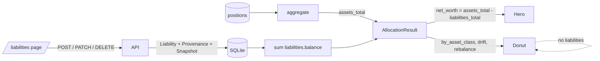

# OpenPortfolio v0.1.7 Execution Plan

**Status:** shipped · 2026-05-04
**Authoritative product spec:** [../openportfolio-roadmap.md](../openportfolio-roadmap.md)
**Authoritative technical spec:** [../architecture.md](../architecture.md)

---

## User stories

End-user point of view for the phase. Every milestone maps back to one of these; acceptance walks them in order.

1. **As a portfolio owner**, I add a liability (free-form kind — mortgage, credit_card, student_loan, auto_loan, heloc, medical, etc.) with a balance and an "as of" date, and the hero "Net worth" immediately reflects it (assets minus liabilities).
2. **As a portfolio owner**, I have a `/liabilities` page listing each debt with its kind, balance, last-updated date, and inline edit/delete.
3. **As a portfolio owner**, my donut, drift, and rebalance views are unchanged — liabilities are not allocations.
4. **As a portfolio owner**, the hero's Net worth provenance tooltip shows the breakdown ("$X assets − $Y liabilities") when liabilities exist.
5. **As a portfolio owner**, every liability create / balance change / delete writes a snapshot so v0.7's timeline can plot true net worth historically.

---

## Guardrails (from [CLAUDE.md](../../CLAUDE.md))

- Math in Python, never in the LLM.
- Provenance on every user-visible number: one `provenance` row per balance write.
- LLM not involved: manual entry only (consistent with v0.1 "paste / manual entry only").
- v0.1 paste/manual only: no broker APIs.
- Currency USD only.

---

## Key design decisions

**Separate `liabilities` table, not negative positions.** Liabilities have no shares, no asset class, no sector/region, and must never appear in the donut, drift, or rebalance code paths. Reusing `positions` with negative values would pollute every allocation code path that assumes `value > 0 = a thing you own`.

**`kind` is free-form.** Consistent with the v0.1.5 M2 decision to replace enum dropdowns with free-form + datalist for `account.type`. Prevents the "other" anti-pattern and lets users write `heloc` or `medical_debt` without code changes.

**Subtraction happens in `get_allocation`, not in `aggregate()`.** The allocation engine is intentionally unaware of liabilities so the donut / drift / rebalance code paths are untouched. `aggregate()` returns `assets_total`; the FastAPI handler adds `liabilities_total` and computes `net_worth = assets_total - liabilities_total`.

**No snapshot schema change.** The maintainer is the only user; reimport is acceptable when semantics shift. Pre-v0.1.7 `Snapshot.net_worth_usd` rows recorded assets-only. Post-v0.1.7 rows mean true net worth. Old rows are honest about what they recorded (zero known liabilities at the time). The hero "since {date}" delta will appear discontinuous after first adding liabilities; this is accepted by the maintainer. `payload_json` grows a `liabilities_total_usd` key so the v0.7 timeline can read both components.

**Snapshot on every liability write.** POST, balance-changing PATCH, and DELETE all write a `Snapshot` row — same pattern as v0.1.5 M6. Label-only or notes-only PATCH does not write a snapshot (matches `patch_account` convention).

**Provenance on balance only.** One `Provenance` row (`entity_type="liability"`) for `balance` on POST (`source="manual"`) and on balance-changing PATCH (`source="override"`). Other fields (label, notes, kind) do not write provenance rows — same convention as `patch_account`.

---

## Data flow

---

## Milestones

### M1 — Backend model + API + math (5 files)

- [`backend/app/models.py`](../../backend/app/models.py) — add `Liability` ORM model. New table created by `Base.metadata.create_all` on lifespan startup. No `ALTER TABLE` migrations required (no existing columns changed).
- [`backend/app/schemas.py`](../../backend/app/schemas.py) — `LiabilityCreate`, `LiabilityPatch`, `LiabilityRead`; extend `AllocationResult` with `assets_total` + `liabilities_total`; extend `ExportResult` with `liabilities`.
- [`backend/app/allocation.py`](../../backend/app/allocation.py) — rename internal `net_worth` accumulator to `assets_total`; `aggregate()` sets `net_worth=assets_total` and `liabilities_total=0.0` as defaults (caller overrides); doc-comment updated.
- [`backend/app/main.py`](../../backend/app/main.py) — `_liabilities_total()` helper; `_write_snapshot()` includes `liabilities_total_usd` in `payload_json` and stores true net worth in `net_worth_usd`; `get_allocation` queries liabilities and patches the result; four new CRUD endpoints; `ExportResult` includes liabilities; `reset_all` deletes liabilities.
- [`backend/tests/test_liabilities.py`](../../backend/tests/test_liabilities.py) (new) — CRUD round-trip, auth guards, sort order, provenance row written on POST and on balance-changing PATCH only, snapshot written on POST / balance-change / DELETE, no snapshot on label-only PATCH, `balance < 0` rejected, free-form kind accepted, `/api/allocation` returns correct `assets_total` / `liabilities_total` / `net_worth`, `GET /api/export` includes liabilities.

### M2 — Frontend (4 files)

- [`frontend/app/lib/api.ts`](../../frontend/app/lib/api.ts) — `Liability`, `LiabilityCreate`, `LiabilityPatch` types; extend `AllocationResult` type with `assets_total` / `liabilities_total`; `api.{liabilities, createLiability, patchLiability, deleteLiability}` methods.
- [`frontend/app/(app)/liabilities/page.tsx`](../../frontend/app/(app)/liabilities/page.tsx) (new) — list / create (inline form) / edit-in-place / delete with AlertDialog confirmation. `<datalist>` for `kind` field. Invalidates SWR `/api/allocation` on every mutation so the hero updates immediately.
- [`frontend/app/(app)/_dashboard/sections/hero.tsx`](../../frontend/app/(app)/_dashboard/sections/hero.tsx) — reads `assets_total` / `liabilities_total` from allocation; passes a `footnote` prop to `<Provenance>` on the Net worth number when liabilities exist.
- [`frontend/app/lib/provenance.tsx`](../../frontend/app/lib/provenance.tsx) — adds optional `footnote` prop appended to the native-title tooltip.
- [`frontend/app/components/app-sidebar.tsx`](../../frontend/app/components/app-sidebar.tsx) — adds `/liabilities` nav entry with `TrendingDown` icon.

### M3 — Docs (3 files)

- `docs/v0.1.7/execution_plan.md` (this file).
- [`docs/openportfolio-roadmap.md`](../openportfolio-roadmap.md) — v0.1.7 row added to §4; link added to §4.2.
- [`README.md`](../../README.md) — liabilities section added.

---

## Explicitly out of scope

- Interest rates, amortization schedules, payoff projections.
- Linking a liability to a specific asset position (mortgage → that house). Possible v0.1.8 follow-up.
- Donut "show net of debt" toggle.
- LLM extraction of liability balances from credit-card / mortgage statements.
- Multi-currency liabilities.
- Liability targets / "max debt" alerts.

---

## Risk notes

- **Hero "since {date}" delta discontinuity**: pre-v0.1.7 snapshots recorded assets-only as `net_worth_usd`. After adding liabilities, the first delta comparison will appear as a drop equal to the current liabilities total. **Accepted by maintainer** — solo alpha; reimport acceptable. Worth a one-line note when reviewing history.
- **`AllocationResult.net_worth` semantic shift**: field previously meant assets-only. Now means true net worth. Only consumer is the in-repo Next.js frontend (single-tenant alpha). The change makes the number accurate.

---

## Acceptance walkthrough

1. `/liabilities` → add "Mortgage", kind=`mortgage` (datalist suggestion), balance=300000, as-of=today → save.
2. Dashboard hero "Net worth" decreases by exactly $300,000; "Investable portfolio" unchanged.
3. Hover the Net worth value → native tooltip shows assets / liabilities breakdown line.
4. `/liabilities` → try to save with balance=−100 → form validation blocks submit; server would also return 422.
5. `/liabilities` → add a second debt with kind=`heloc` (typed, not in datalist) → saves successfully (free-form kind).
6. Donut, drift status, rebalance — all unchanged.
7. `GET /api/export` → response includes `liabilities[]`.
8. Most recent `Snapshot.payload_json` includes `liabilities_total_usd: 300000`.
9. Edit the mortgage balance to $295,000 → hero reflects, new snapshot written, new `provenance` row exists for the changed `balance`.
10. Edit only the label (e.g. "Primary mortgage") → no new provenance row, no new snapshot.
11. Delete the mortgage → hero returns to original; snapshot written.
