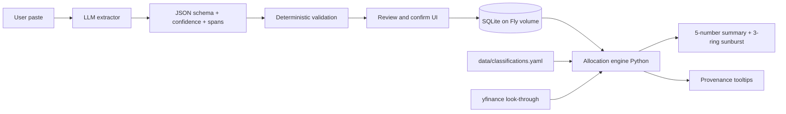

# OpenPortfolio v0.1 Execution Plan

**Status:** draft · 2026-04-18
**Authoritative spec:** [../openportfolio-roadmap.md](../openportfolio-roadmap.md)
**Sequencing:** vertical thin slice first — each milestone ends in something visibly working on https://openportfolio.fly.dev

---

## Guardrails (from [CLAUDE.md](../../CLAUDE.md))

- Math in Python, never in the LLM.
- Every LLM extraction ships with schema + confidence + source span + deterministic validation + mandatory review UI.
- Every user-visible number shows provenance on hover.
- One feature per branch. If a task touches >5 files, split it.
- Tests land with every extraction fixture and allocation calc.

## Current state

- [backend/app/main.py](../../backend/app/main.py): only `/health`. No DB, no models, no auth.
- [frontend/app/page.tsx](../../frontend/app/page.tsx): bare `<h1>OpenPortfolio</h1>`.
- No `data/classifications.yaml`, no Fly volume, no secrets.
- [CLAUDE.md](../../CLAUDE.md) mentions Drizzle on the frontend; **ignore in v0.1** — auth is env-var token, no frontend DB needed until v0.2 Auth.js.

## Flow being built

---

## Milestones

### M0 — Fly infra prerequisites

Goal: persistent volume mounted, all secrets set, deploy still green.

- Create persistent SQLite volume in `sjc`, 1GB, name `op_data`.
- Mount at `/data` in [fly.toml](../../fly.toml) via `[mounts]`.
- Set secrets:
  - `ADMIN_TOKEN` — random 32-byte value
  - `LLM_PROVIDER=azure`
  - `AZURE_API_KEY`
  - `AZURE_API_BASE` — e.g. `https://<resource>.openai.azure.com`
  - `AZURE_API_VERSION` — e.g. `2025-03-01-preview`
  - `AZURE_DEPLOYMENT_NAME` — the GPT-5.4 deployment name in the Azure resource
- Verify volume mount with `fly ssh console` → `ls /data`.
- Health check already green; deploy is green after mount change.

### M1 — Data model + admin-token auth

Goal: schema from roadmap §6 exists; FastAPI rejects unauthenticated calls.

- Add deps to [backend/pyproject.toml](../../backend/pyproject.toml): `sqlalchemy>=2`, `pydantic-settings`. Skip Alembic for v0.1 and use `Base.metadata.create_all` (minimum code; revisit at v1.0).
- `backend/app/db.py`: engine pointing at `sqlite:////data/openportfolio.db` (env-overridable to `./dev.db` locally).
- `backend/app/models.py`: `Account`, `Position`, `Classification`, `Snapshot`, `Provenance` per roadmap §6 data model.
- `backend/app/auth.py`: `require_admin_token` FastAPI dependency reading `ADMIN_TOKEN` from env, compares against `X-Admin-Token` header (constant-time).
- `backend/app/main.py`: call `Base.metadata.create_all` on startup, wire dependency globally (health endpoint stays unauthenticated).
- Tests: `backend/tests/test_auth.py` covering 401 without token, 200 with correct token.

### M2 — Vertical slice: paste → review → commit → 1-ring sunburst

Goal: paste positions from one account, confirm, see a single-ring sunburst colored by asset class. First user-visible milestone.

**Seed data**

- `data/classifications.yaml`: ~10 tickers (`VTI`, `VXUS`, `BND`, `VNQ`, `GLD`, `BTC`, `SPY`, `QQQ`, `AAPL`, `CASH`) with `asset_class`, `sub_class`, `sector`, `region`.

**Backend**

- `backend/app/llm.py`: LiteLLM wrapper, provider/model from env. Default Azure OpenAI GPT-5.4 (`model="azure/<AZURE_DEPLOYMENT_NAME>"`, api_base/api_version/api_key from env). Single function `extract_positions(text: str) -> ExtractionResult` with strict JSON schema (ticker, shares, cost_basis, confidence, source_span) using LiteLLM `response_format={"type": "json_schema", ...}`.
- `backend/app/validation.py`: deterministic checks — ticker regex `^[A-Z][A-Z0-9.-]{0,9}$`, shares > 0, no >6-digit runs in source spans, plausibility bounds.
- `backend/app/allocation.py`: v0.1 stub — `position_to_slice(position, classifications) -> Slice` with NO look-through yet, sum-by-asset-class.
- Endpoints (all admin-token guarded):
  - `POST /api/extract` → returns `ExtractionResult` (no DB writes).
  - `POST /api/positions/commit` → accepts reviewed rows, upserts into `positions` + `provenance`.
  - `GET /api/allocation` → returns `{total, by_asset_class: [{name, value, pct, provenance}]}`.
  - `GET /api/accounts`, `POST /api/accounts`.
- Tests: `backend/tests/fixtures/` with 3 paste fixtures (Fidelity-ish, Vanguard-ish, Schwab-ish). `test_extract.py` snapshots expected extraction. `test_allocation.py` locks the math.

**Frontend**

- Add deps to [frontend/package.json](../../frontend/package.json): `echarts`, `echarts-for-react`, `swr`.
- `frontend/app/lib/api.ts`: thin client; admin token lives in `localStorage` (one-time prompt, plain input — v0.1 is single user).
- `frontend/app/paste/page.tsx`: textarea → `POST /api/extract` → review table with rows sorted by confidence ascending, color-coded, each row editable before commit.
- `frontend/app/page.tsx`: fetch `/api/allocation` → 1-ring sunburst via ECharts + total net worth headline.
- `frontend/app/lib/provenance.tsx`: `<Provenance>` tooltip wrapper used on every number.

**Acceptance for M2**

- Paste Fidelity-style text into `/paste`, review diff, commit, see sunburst update on `/`. All numbers have provenance on hover.

### M3 — Accounts, non-brokerage manual entry, provenance polish

- `frontend/app/accounts/page.tsx`: list/create labeled buckets. Paste flow assigns to an account.
- `frontend/app/manual/page.tsx`: form for non-brokerage assets (real estate, gold, crypto, private, HSA cash sleeve). Writes `positions` with `source='manual'` and synthetic tickers like `REALESTATE:123Main`.
- Expand `data/classifications.yaml` to ~50 tickers covering maintainer's real holdings.
- `backend/app/main.py`: `DELETE /api/positions/{id}` + `PATCH` for user overrides (HSA cash/invested split).
- Provenance labels on every hero number: "source, captured_at, confidence".

### M4 — Look-through + 3-ring sunburst + 5-number summary

- `backend/app/lookthrough.py`: `yfinance` primary with 24h cache in SQLite (`fund_holdings` table — extension of schema, not redesign). YAML fallback `data/lookthrough.yaml` for niche funds.
- Extend `allocation.py` to walk fund holdings → sum effective weights across `asset_class`, `sub_class`, `sector`, `region`.
- Test fixtures: `backend/tests/fixtures/portfolios/` with expected allocations for 3 portfolios (all-VTI, 60/40, real-world mix). Locks math.
- Frontend: hero screen now shows 5-number summary strip + 3-ring interactive sunburst (asset → sub → sector/region) + drill-down side panel.
- **Acceptance gate (roadmap §4):** user answers "what fraction is cash?" in <5 seconds without hovering. If sunburst fails, evaluate treemap fallback before M5.

### M5 — Ship-ready: Ollama, exports, backups, CI

- `backend/app/llm.py`: Ollama adapter path as v0.1 local alternative (`LLM_PROVIDER=ollama`, `LLM_MODEL=llama3.1` etc.). Azure remains the default.
- Client-side paste scrub: strip ≥6 consecutive digits that aren't plausible share counts before `/api/extract`.
- `GET /api/export` → full JSON export of accounts, positions, classifications, snapshots.
- Nightly cron in Fly → JSON snapshot pushed to Tigris bucket (risk #9 mitigation). Acceptable to defer if Tigris not set up; document in `README.md`.
- `.github/workflows/test.yml`: run backend pytest on every push. Deploy already wired in `.github/workflows/fly-deploy.yml`.
- README update covering setup, admin-token flow, LLM provider config.

### Acceptance (v0.1 "done")

From roadmap §4: maintainer pastes 6 accounts in <3 min, adds non-brokerage assets in <2 min, sees correct sunburst, answers "what fraction is cash?" and "what's my real US equity exposure?" Hero-viz test passes the 5-second check.

---

## Task checklist

- [x] **M0 infra** — Fly `sjc` volume `op_data` (1GB, `vol_4ojknjom2pgo8wor`), `/data` mount verified (`lost+found` visible), scaled to 1 machine (SQLite single-writer), 6 secrets deployed (`ADMIN_TOKEN`, `LLM_PROVIDER=azure`, 4 Azure vars), `/health` green.
- [x] **M1 schema** — `sqlalchemy` 2.0.49 + `pydantic-settings` 2.13.1 deps, `backend/app/db.py` + `models.py` (5 tables per roadmap section 6), `create_all` on FastAPI startup lifespan. `docker-compose.yml` mounts named volume at `/data` to match prod.
- [x] **M1 auth** — `backend/app/auth.py` `require_admin_token` (constant-time `hmac.compare_digest`, 503 when unconfigured to prevent empty-token footgun). 4 pytest cases covering missing/wrong/correct token + unconfigured server. Dev deps in `[dependency-groups].dev` so `uv sync --no-dev` keeps prod image lean.
- [ ] **M2 classifications seed** — `data/classifications.yaml` with ~10 seed tickers.
- [ ] **M2 LLM extract** — `llm.py` LiteLLM Azure wrapper + `validation.py` + `POST /api/extract` with schema/confidence/spans.
- [ ] **M2 allocation stub** — `allocation.py` stub + `GET /api/allocation` + `POST /api/positions/commit` + account CRUD.
- [ ] **M2 extract tests** — 3 paste fixtures + `test_extract.py` + `test_allocation.py`.
- [ ] **M2 frontend paste** — `echarts` + `swr` deps, `lib/api.ts`, `/paste` review-and-confirm UI sorted by confidence.
- [ ] **M2 frontend sunburst** — `/` 1-ring ECharts sunburst + net worth headline + `<Provenance>` tooltip wrapper.
- [ ] **M3 accounts UI** — `/accounts` labeled buckets, paste assigns to account.
- [ ] **M3 manual entry** — `/manual` form for real estate, gold, crypto, private, HSA cash.
- [ ] **M3 classifications expand** — ~50 real holdings in YAML + `PATCH`/`DELETE` position endpoints for user overrides.
- [ ] **M4 look-through** — `lookthrough.py` (yfinance + 24h SQLite cache + YAML fallback).
- [ ] **M4 allocation full** — walk fund holdings across `asset_class`/`sub_class`/`sector`/`region`; portfolio fixture tests.
- [ ] **M4 hero 3-ring** — 3-ring sunburst + 5-number summary + drill-down panel; 5-second cash test gate.
- [ ] **M5 Ollama** — Ollama adapter path in `llm.py`.
- [ ] **M5 scrub + export** — client-side paste scrubbing + `GET /api/export`.
- [ ] **M5 backup + CI** — nightly Tigris snapshot + `.github/workflows/test.yml` + README update.
- [ ] **M5 acceptance** — run roadmap §4 end-to-end (6 accounts <3min, non-brokerage <2min, cash % in <5s).

---

## Scope discipline

Explicitly **not** shipping in v0.1 (roadmap §4 non-goals): returns, benchmarks, backtesting, tax lots, multi-currency, mobile, multi-user, AI chat, PDF, OCR, broker APIs. If any of those creep into a PR, stop and split.
