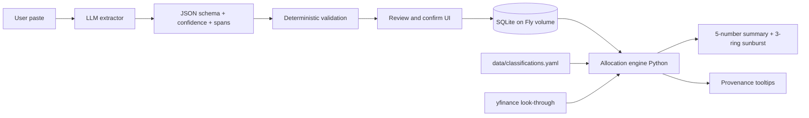

# OpenPortfolio v0.1 Execution Plan

**Status:** draft · 2026-04-18
**Authoritative product spec:** [../openportfolio-roadmap.md](../openportfolio-roadmap.md) · **Technical spec:** [../architecture.md](../architecture.md)
**Sequencing:** vertical thin slice first — each milestone ends in something visibly working on https://openportfolio.fly.dev

---

## Guardrails (from [CLAUDE.md](../../CLAUDE.md))

- Math in Python, never in the LLM.
- Every LLM extraction ships with schema + confidence + source span + deterministic validation + mandatory review UI.
- Every user-visible number shows provenance on hover.
- One feature per branch. If a task touches >5 files, split it.
- Tests land with every extraction fixture and allocation calc.

## Current state

- [backend/app/main.py](../../backend/app/main.py): only `/health`. No DB, no models, no auth.
- [frontend/app/page.tsx](../../frontend/app/page.tsx): bare `<h1>OpenPortfolio</h1>`.
- No `data/classifications.yaml`, no Fly volume, no secrets.
- [CLAUDE.md](../../CLAUDE.md) mentions Drizzle on the frontend; **ignore in v0.1** — auth is env-var token, no frontend DB needed until v0.2 Auth.js.

## Flow being built

---

## Milestones

### M0 — Fly infra prerequisites

Goal: persistent volume mounted, all secrets set, deploy still green.

- Create persistent SQLite volume in `sjc`, 1GB, name `op_data`.
- Mount at `/data` in [fly.toml](../../fly.toml) via `[mounts]`.
- Set secrets:
  - `ADMIN_TOKEN` — random 32-byte value
  - `LLM_PROVIDER=azure`
  - `AZURE_API_KEY`
  - `AZURE_API_BASE` — e.g. `https://<resource>.openai.azure.com`
  - `AZURE_API_VERSION` — e.g. `2025-03-01-preview`
  - `AZURE_DEPLOYMENT_NAME` — the GPT-5.4 deployment name in the Azure resource
- Verify volume mount with `fly ssh console` → `ls /data`.
- Health check already green; deploy is green after mount change.

### M1 — Data model + admin-token auth

Goal: schema from [architecture.md](../architecture.md#data-model) exists; FastAPI rejects unauthenticated calls.

- Add deps to [backend/pyproject.toml](../../backend/pyproject.toml): `sqlalchemy>=2`, `pydantic-settings`. Skip Alembic for v0.1 and use `Base.metadata.create_all` (minimum code; revisit at v1.0).
- `backend/app/db.py`: engine pointing at `sqlite:////data/openportfolio.db` (env-overridable to `./dev.db` locally).
- `backend/app/models.py`: `Account`, `Position`, `Classification`, `Snapshot`, `Provenance` per [architecture.md](../architecture.md#data-model) data model.
- `backend/app/auth.py`: `require_admin_token` FastAPI dependency reading `ADMIN_TOKEN` from env, compares against `X-Admin-Token` header (constant-time).
- `backend/app/main.py`: call `Base.metadata.create_all` on startup, wire dependency globally (health endpoint stays unauthenticated).
- Tests: `backend/tests/test_auth.py` covering 401 without token, 200 with correct token.

### M2 — Vertical slice: paste → review → commit → 1-ring sunburst

Goal: paste positions from one account, confirm, see a single-ring sunburst colored by asset class. First user-visible milestone.

**Seed data**

- `data/classifications.yaml`: ~10 tickers (`VTI`, `VXUS`, `BND`, `VNQ`, `GLD`, `BTC`, `SPY`, `QQQ`, `AAPL`, `CASH`) with `asset_class`, `sub_class`, `sector`, `region`.

**Backend**

- `backend/app/llm.py`: LiteLLM wrapper, provider/model from env. Default Azure OpenAI GPT-5.4 (`model="azure/<AZURE_DEPLOYMENT_NAME>"`, api_base/api_version/api_key from env). Single function `extract_positions(text: str) -> ExtractionResult` with strict JSON schema (ticker, shares, cost_basis, confidence, source_span) using LiteLLM `response_format={"type": "json_schema", ...}`.
- `backend/app/validation.py`: deterministic checks — ticker regex `^[A-Z][A-Z0-9.-]{0,9}$`, shares > 0, no >6-digit runs in source spans, plausibility bounds.
- `backend/app/allocation.py`: v0.1 stub — `position_to_slice(position, classifications) -> Slice` with NO look-through yet, sum-by-asset-class.
- Endpoints (all admin-token guarded):
  - `POST /api/extract` → returns `ExtractionResult` (no DB writes).
  - `POST /api/positions/commit` → accepts reviewed rows, upserts into `positions` + `provenance`.
  - `GET /api/allocation` → returns `{total, by_asset_class: [{name, value, pct, provenance}]}`.
  - `GET /api/accounts`, `POST /api/accounts`.
- Tests: `backend/tests/fixtures/` with 3 paste fixtures (Fidelity-ish, Vanguard-ish, Schwab-ish). `test_extract.py` snapshots expected extraction. `test_allocation.py` locks the math.

**Frontend**

- Add deps to [frontend/package.json](../../frontend/package.json): `echarts`, `echarts-for-react`, `swr`.
- `frontend/app/lib/api.ts`: thin client; admin token lives in `localStorage` (one-time prompt, plain input — v0.1 is single user).
- `frontend/app/paste/page.tsx`: textarea → `POST /api/extract` → review table with rows sorted by confidence ascending, color-coded, each row editable before commit.
- `frontend/app/page.tsx`: fetch `/api/allocation` → 1-ring sunburst via ECharts + total net worth headline.
- `frontend/app/lib/provenance.tsx`: `<Provenance>` tooltip wrapper used on every number.

**Acceptance for M2**

- Paste Fidelity-style text into `/paste`, review diff, commit, see sunburst update on `/`. All numbers have provenance on hover.

### M3 — Accounts, non-brokerage manual entry, provenance polish

- `frontend/app/accounts/page.tsx`: list/create labeled buckets. Paste flow assigns to an account.
- `frontend/app/manual/page.tsx`: form for non-brokerage assets (real estate, gold, crypto, private, HSA cash sleeve). Writes `positions` with `source='manual'` and synthetic tickers like `REALESTATE:123Main`.
- Expand `data/classifications.yaml` to ~50 tickers covering maintainer's real holdings.
- `backend/app/main.py`: `DELETE /api/positions/{id}` + `PATCH` for user overrides (HSA cash/invested split).
- Provenance labels on every hero number: "source, captured_at, confidence".

### M4 — Look-through + 3-ring sunburst + 5-number summary

- `backend/app/lookthrough.py`: `yfinance` primary with 24h cache in SQLite (`fund_holdings` table — extension of schema, not redesign). YAML fallback `data/lookthrough.yaml` for niche funds.
- Extend `allocation.py` to walk fund holdings → sum effective weights across `asset_class`, `sub_class`, `sector`, `region`.
- Test fixtures: `backend/tests/fixtures/portfolios/` with expected allocations for 3 portfolios (all-VTI, 60/40, real-world mix). Locks math.
- Frontend: hero screen now shows 5-number summary strip + 3-ring interactive sunburst (asset → sub → sector/region) + drill-down side panel.
- **Acceptance gate (v0.1 Foundation — [roadmap](../openportfolio-roadmap.md) phase 0.1):** user answers "what fraction is cash?" in <5 seconds without hovering. If sunburst fails, evaluate treemap fallback before M5.

### M5 — Ship-ready: Ollama, paste scrub, export, README

- `backend/app/llm.py`: Ollama adapter path as v0.1 local alternative (`LLM_PROVIDER=ollama`, `LLM_MODEL=llama3.1` etc.). Azure remains the default.
- Client-side paste scrub: strip ≥6 consecutive digits that aren't plausible share counts before `/api/extract`.
- `GET /api/export` → full JSON export of accounts, positions, classifications, snapshots. Manual backup mechanism for v0.1 (risk #9).
- README covering setup, admin-token flow, LLM provider config, manual backup workflow.

**Deferred to later phases:**
- Nightly Tigris backup cron ([roadmap](../openportfolio-roadmap.md) phase 1.0 Harden). `/api/export` covers the manual case.
- `.github/workflows/test.yml` ([roadmap backlog](../openportfolio-roadmap.md#41-backlog-unphased): GitHub Actions CI). Local `./scripts/docker-test.sh` covers the dev loop; Fly deploy workflow stays.
- yfinance taxonomy normalization ([roadmap backlog](../openportfolio-roadmap.md#41-backlog-unphased)). Adapter is wired + gated; flip one config flag after normalization lands.

### Acceptance (v0.1 "done")

From v0.1 Foundation acceptance ([roadmap](../openportfolio-roadmap.md) phase 0.1): maintainer pastes 6 accounts in <3 min, adds non-brokerage assets in <2 min, sees correct sunburst, answers "what fraction is cash?" and "what's my real US equity exposure?" Hero-viz test passes the 5-second check.

---

## Task checklist

- [x] **M0 infra** — Fly `sjc` volume `op_data` (1GB, `vol_4ojknjom2pgo8wor`), `/data` mount verified (`lost+found` visible), scaled to 1 machine (SQLite single-writer), 6 secrets deployed (`ADMIN_TOKEN`, `LLM_PROVIDER=azure`, 4 Azure vars), `/health` green.
- [x] **M1 schema** — `sqlalchemy` 2.0.49 + `pydantic-settings` 2.13.1 deps, `backend/app/db.py` + `models.py` (5 tables per [architecture.md](../architecture.md#data-model)), `create_all` on FastAPI startup lifespan. `docker-compose.yml` mounts named volume at `/data` to match prod.
- [x] **M1 auth** — `backend/app/auth.py` `require_admin_token` (constant-time `hmac.compare_digest`, 503 when unconfigured to prevent empty-token footgun). 4 pytest cases covering missing/wrong/correct token + unconfigured server. Dev deps in `[dependency-groups].dev` so `uv sync --no-dev` keeps prod image lean.
- [x] **M2 classifications seed** — `data/classifications.yaml` (10 tickers: VTI/VXUS/BND/VNQ/GLD/BTC/SPY/QQQ/AAPL/CASH). `backend/app/classifications.py` YAML loader returns frozen `ClassificationEntry` dataclasses, path resolves identically in dev (`repo_root/data`) and prod (`/app/data`). `pyyaml`+`types-pyyaml` added, `uv.lock` regenerated. Dockerfile `COPY data/ /app/data/` verified in image. 8 loader tests + 4 pre-existing auth tests green.
- [x] **M2 LLM extract** — `llm.py` LiteLLM Azure wrapper + `validation.py` + `POST /api/extract` with schema/confidence/spans.
  - [x] **M2.2a schemas + validation** — `backend/app/schemas.py` Pydantic `ExtractedPosition`/`ExtractionResult` (confidence 0-1 enforced at parse). `backend/app/validation.py` pure validators: ticker regex, shares>0 + plausibility, cost_basis>=0 + plausibility, 6+ digit run PII heuristic. Advisory (annotates `validation_errors`, never rejects). 23 unit tests cover each validator + composition + immutability.
  - [x] **M2.2b LLM adapter + endpoint** — `backend/app/llm.py` LiteLLM wrapper calling `azure/<deployment>` with strict `response_format=json_schema` (ticker/shares/cost_basis/confidence/source_span). `config.py` extended with Azure + `llm_provider` settings. `POST /api/extract` in `main.py` guarded by admin-token, returns annotated `ExtractionResult`. 3 paste fixtures (fidelity/vanguard/schwab) + recorded `*_llm.json` snapshots; tests replace `litellm.completion` via mock (no Azure in CI). 19 new tests: provider/config guards, per-fixture extraction, validation wiring (lowercase `aapl` row triggers ticker regex error), endpoint auth, recorded-fixture sanity. 54/54 total green; Docker build green.
- [x] **M2 allocation stub** — `allocation.py` stub + `GET /api/allocation` + `POST /api/positions/commit` + account CRUD.
  - Allocation: `position_value` precedence `market_value > cost_basis > 0`; `aggregate` groups by `asset_class`, sorts slices by value desc, surfaces `unclassified_tickers` (stable de-dup). 16 unit/endpoint tests lock the math.
  - Commit: auto-seeds "Default" brokerage on first commit per Decision 1(a); writes one `Provenance` row per numeric field (shares/cost_basis/market_value), skipping nulls. ticker is a label, not a number — no provenance row. 8 tests cover auth, account resolution, DB writes, null handling, batch commit.
  - Accounts: `GET /api/accounts`, `POST /api/accounts` (defaults type=brokerage). 5 tests.
  - `models.Position.market_value` added (nullable) — schema extension per [architecture.md](../architecture.md#data-model) ("locked; extended in later phases"). **Ops note:** existing Fly DB must be recreated (`fly ssh console -C 'rm /data/openportfolio.db'`) since there's no Alembic; no data loss (no positions committed yet).
  - `conftest.py` — shared `client` + `test_db` fixtures (fresh SQLite per test via `tmp_path` + `dependency_overrides`).
- [x] **M2 extract tests** — 3 paste fixtures + `test_extract.py` + `test_allocation.py`. (Delivered across M2.2b + M2.3.)
- [x] **M2 frontend paste** — `echarts` + `echarts-for-react` + `swr` deps; `frontend/app/lib/api.ts` typed client (admin token in `localStorage`, one-time prompt, 401 clears token); `frontend/app/lib/provenance.tsx` native-title hover wrapper for every on-screen number; `frontend/app/paste/page.tsx` textarea → Extract → editable review table (rows sorted confidence asc, color-coded by confidence + validation errors, per-row selection) → Commit; account dropdown with "Default (auto-create)" fallback. `nginx.conf` proxies `/api/` → backend. Root nav links in `layout.tsx`. Next.js standalone build green (`docker build`); 86 backend tests still green.
- [x] **M2 frontend sunburst** — `/` 1-ring ECharts sunburst + net worth headline + `<Provenance>` tooltip wrapper. `frontend/app/page.tsx` is a client component: SWR fetches `/api/allocation`, ECharts dynamically imported (`ssr: false`) to keep it out of the server bundle. Hero number = sum of committed positions (market_value → cost_basis fallback); slices sorted desc by value; unclassified tickers surfaced in a red banner. Breakdown table mirrors the sunburst. Each number wrapped in `<Provenance>`. Loading/error/empty states handled. `docker build` green.
- [x] **M3 accounts UI** — `/accounts` list+create page; `type` enum surfaces brokerage/hsa/ira/roth_ira/401k/529/real_estate/crypto/private/cash. Paste dropdown already assigns to account.
- [x] **M3 manual entry** — `/manual` form emits synthetic tickers (`REALESTATE:slug`, `GOLD:*`, `SILVER:*`, `CRYPTO:*`, `PRIVATE:*`, `HSA_CASH:*`) via the existing `/api/positions/commit` with `source="manual"`. Prefix-based classifier in `app/classifications.py` resolves them without YAML edits.
- [x] **M3 classifications expand** — `data/classifications.yaml` now ~50 tickers (broad-market/sector ETFs, intl developed+emerging, 8 individual US stocks incl. BRK.B, 8 fixed-income, REITs, metals, crypto, TDFs, money market). `PATCH /api/positions/{id}` writes an `override` provenance row per changed numeric field; `DELETE /api/positions/{id}` preserves the provenance audit trail. `/positions` page provides inline edit + delete.
- [x] **M4 look-through** — `backend/app/lookthrough.py` resolves breakdown in order: 24h SQLite cache (`fund_holdings` table) → yfinance (stubbed, gated behind `settings.lookthrough_yfinance_enabled`, OFF by default until M5 normalizes Yahoo's taxonomy) → `data/lookthrough.yaml` (12 funds). yfinance dep added to `pyproject.toml`.
- [x] **M4 allocation full** — `allocation.aggregate` rewritten as a 3-ring engine (asset_class → sub_class → sector for equity / region for non-equity) plus `FiveNumberSummary` (net_worth, cash_pct, us_equity_pct, intl_equity_pct, alts_pct) computed in the same pass. `AllocationSlice.children` + `AllocationResult.summary` land on the schema. `backend/tests/test_portfolios.py` pins math for all-VTI, 60/40, and a 9-position real-world mix with synthetics.
- [x] **M4 hero 3-ring** — `/` now has 5-number summary strip up top, 3-ring ECharts sunburst with click-to-drill side panel, breakdown table below. Every number wrapped in `<Provenance>`. Next.js build green; live docker smoke test confirms 3-ring payload shape + summary percentages (60k VTI / 40k BND / 650k REALESTATE → us_equity 8.0%, alts 86.7%).
- [x] **M5 Ollama** — `llm._provider_config()` now dispatches on `settings.llm_provider` (azure | ollama), model string becomes `ollama/<LLM_MODEL>` with `OLLAMA_API_BASE` routed to LiteLLM. 2 new tests (missing model + kwargs passthrough); no Azure kwargs leak.
- [x] **M5 scrub + export** — `frontend/app/lib/scrub.ts` replaces `\b\d{6,}(?!\.\d)\b` runs with `[REDACTED]` before every `/api/extract` POST; `/paste` surfaces the redaction count. `GET /api/export` (admin-token guarded) dumps accounts + positions + provenance + snapshots; excludes the yfinance cache + source-controlled YAMLs. 4 new endpoint tests.
- [x] **M5 README** — `README.md` covers setup, local/docker workflow, Fly deploy, Azure + Ollama config, data-file editing, manual backup via `/api/export`. `.env.example` checked in.
- [ ] **M5 acceptance** — run v0.1 Foundation acceptance end-to-end (6 accounts <3min, non-brokerage <2min, cash % in <5s). *Requires real maintainer paste data + Azure quota; gated on M5 PR merge + redeploy.*
- **Deferred** ([roadmap](../openportfolio-roadmap.md)): nightly Tigris snapshot → v1.0; GitHub Actions CI + yfinance normalization → [backlog](../openportfolio-roadmap.md#41-backlog-unphased).

---

## Scope discipline

Explicitly **not** shipping in v0.1 Foundation (original v0.1 non-goals; still see [roadmap backlog](../openportfolio-roadmap.md#41-backlog-unphased)): returns, benchmarks, backtesting, tax lots, multi-currency, mobile, multi-user, AI chat, PDF, OCR, broker APIs. If any of those creep into a PR, stop and split.

---

**Next:** [v0.1.5 Entity management](../v0.1.5/execution_plan.md)
