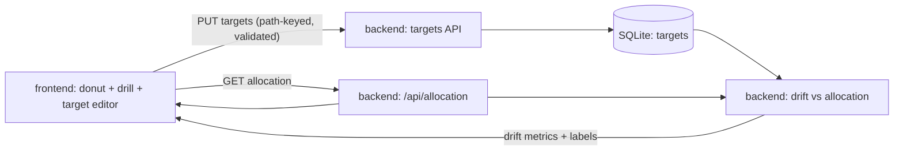

# OpenPortfolio v0.2 Execution Plan

**Status:** draft · 2026-04-20  
**Authoritative product spec:** [../openportfolio-roadmap.md](../openportfolio-roadmap.md)  
**Authoritative technical spec:** [../architecture.md](../architecture.md)

---

## User stories

End-user point of view for the phase. Every milestone maps back to one of these; acceptance walks them in order.

1. **As a portfolio owner**, I can define **target allocations at the donut root** (asset-class level) so my actual weights have something to compare against without leaving the hero view.
2. **As a portfolio owner**, when I drill into an asset class I can set **independent targets for that drill-down level** (L2 under L1), so nested views stay meaningful without forcing root targets to imply child targets.
3. **As a portfolio owner**, when targets at a level do not sum to **100%**, I get a clear validation error before anything is saved, so I never persist nonsense weights.
4. **As a portfolio owner**, I see a **drift ring on the donut** and a **drift pill** (or equivalent compact status) that summarizes how far current allocation is from targets, using deterministic math I can trust.
5. **As a portfolio owner**, when I have **not set targets** yet, the UI explicitly shows **“no target”** (or equivalent) instead of implying zero drift or hiding the concept.
6. **As a portfolio owner**, **equity sector** breakdown in drill-down remains **informational only** in this phase — I can see sector exposure for context, but sector-level targets are out of scope unless pulled in by a later phase.

---

## Guardrails (from [CLAUDE.md](../../CLAUDE.md))

- Math in Python, never in the LLM.
- Every LLM extraction ships with schema + confidence + source span + deterministic validation + mandatory review UI (unchanged from v0.1).
- Every user-visible number shows provenance on hover.
- One feature per branch. Touches >5 files → stop, split.
- Tests land with every extraction fixture and allocation calc.

## Key design decision

Targets and drift operate at **two levels** that are **independent**: **L1** (donut root / asset class) and **L2** (per drill-down context). Root targets do not auto-derive child targets; each level is edited and validated on its own **100%** sum rule where targets apply.

**Equity sector** stays **info-only** for v0.2: sector breakdown continues to explain exposure; **sector targets** are not required for acceptance.

**Drift** (including anything shown on the ring, pill, or tables) is computed in **Python** from current allocation plus stored targets — never inferred by an LLM and not recomputed heuristically in the browser beyond displaying server-provided numbers.

**Persistence** uses stable **path keys** (e.g. asset-class id and drill path) so targets survive refactors of layout copy and map cleanly to `aggregate()` / allocation slices.

## Data flow

## Milestones

### M1 — Backend: targets storage, validation, drift

- Persist targets keyed by portfolio (and path keys for L1/L2). Enforce **100%** sum (or documented empty state) per target scope on write.
- Combine stored targets with existing allocation pipeline so **drift** is computed deterministically in Python; expose fields needed for ring, pill, and any tabular drift columns.
- Tests: validation edge cases (sum ≠ 100%, missing targets), drift correctness against fixtures, alignment with allocation totals.

### M2 — Frontend: edit targets, show drift, empty state

- Donut root: show target entry / summary, drift ring + drift pill using API values; **“no target”** when none configured.
- Drill-down: L2 target editing where in scope; independent from L1. **Equity sector** view remains display-only for targets.
- Provenance on hover for user-visible numbers per project rules.

### M3 — Acceptance

- This execution plan.
- Roadmap: phase table and §4.2 link for v0.2.

## Acceptance walkthrough (UI)

1. **No targets** (story 5): Fresh scope shows **no target** (or equivalent) for drift; no false “0% drift” implied.
2. **L1 targets + validation** (stories 1, 3): Set root targets; attempt save with sum ≠ **100%** → blocked with clear error; valid **100%** → saved.
3. **Drift at root** (story 4): After save, donut shows **drift ring** and **drift pill** consistent with side table / tooltip provenance.
4. **Drill + L2 targets** (story 2): Drill into an asset class; set L2 targets independent of L1; **100%** rule applies at that level; drift reflects that context.
5. **Equity sector info-only** (story 6): Toggle or view equity by sector; confirm **no sector target** controls ship in v0.2; sector remains explanatory.

## Explicitly NOT in v0.2

- **Trade recommendations** to close drift (v0.5 Rebalance recommendations).
- **PDF import** / statement drag-and-drop (v0.4 PDF Import).
- **Design polish** as a goal (v0.3 Design & Polish) — v0.2 ships function-first visuals consistent with v0.1.6, not a new visual system.

## Scope discipline

If PDF parsing, rebalance trade lists, or broad visual redesign creep in, stop and split.

---

**Prior:** [v0.1.6 Portfolio donut view redesign](../v0.1.6/execution_plan.md)
